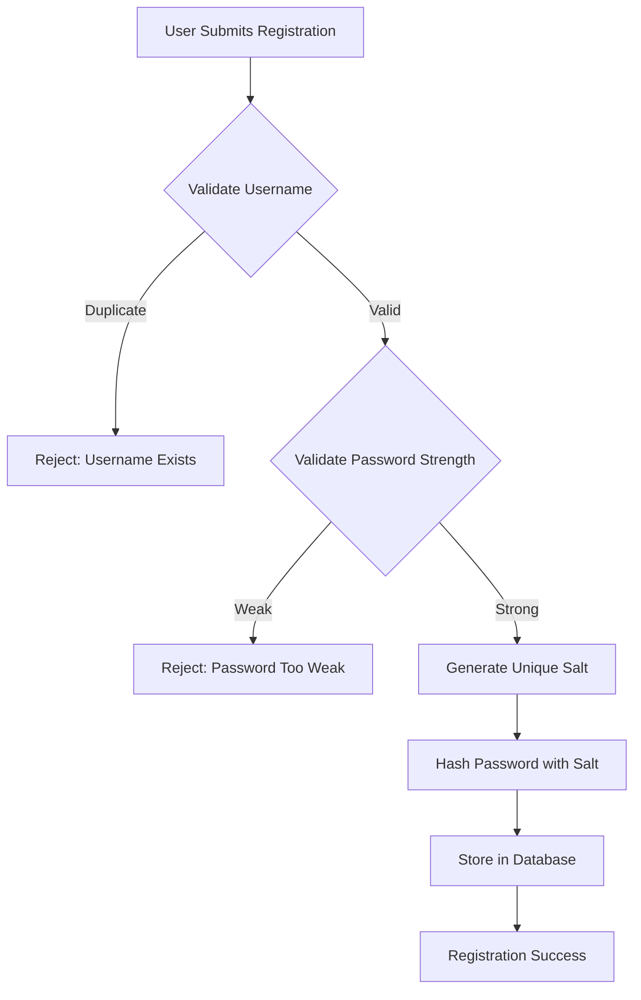
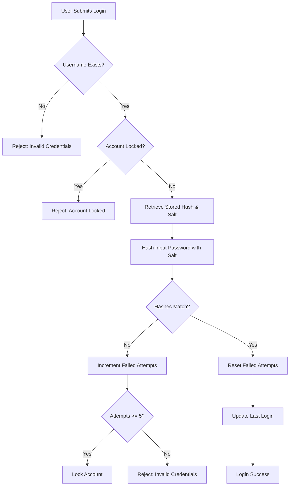

# 🔒 Banking System - Security Implementation Guide

This document provides comprehensive information about the security features implemented in the Banking System application.

---

## 📋 Table of Contents

1. [Security Overview](#security-overview)
2. [Password Security](#password-security)
3. [Authentication System](#authentication-system)
4. [SQL Injection Prevention](#sql-injection-prevention)
5. [Audit Logging](#audit-logging)
6. [Session Management](#session-management)
7. [Security Best Practices](#security-best-practices)
8. [Security Testing](#security-testing)

---

## 🛡️ Security Overview

The Banking System implements **defense in depth**, using multiple layers of security:

| Layer | Implementation | Status |
|-------|----------------|--------|
| **Application Security** | Password hashing, input validation | ✅ Implemented |
| **Database Security** | PreparedStatements, least privilege | ✅ Implemented |
| **Authentication** | Secure login, account locking | ✅ Implemented |
| **Authorization** | Role-based access control | ✅ Implemented |
| **Audit Trail** | Complete activity logging | ✅ Implemented |

---

## 🔐 Password Security

### Hashing Algorithm: SHA-256

The application uses **SHA-256 (Secure Hash Algorithm 256-bit)** for password hashing.

#### Why SHA-256?

- ✅ **Cryptographically secure** - One-way function
- ✅ **Fixed output** - Always 256 bits (32 bytes)
- ✅ **Collision resistant** - Extremely difficult to find two inputs with same hash
- ✅ **Widely adopted** - Industry standard

### Salt Generation

Each password gets a **unique 16-byte random salt**.

#### Why Use Salt?

```
Without Salt:
  password "hello" → hash: "2cf24dba5fb0a30e..."
  password "hello" → hash: "2cf24dba5fb0a30e..." ← Same hash! ❌

With Salt:
  password "hello" + salt "abc123" → hash: "9f86d081884c7d65..."
  password "hello" + salt "xyz789" → hash: "a7f8d19b23c4e5f6..." ← Different! ✅
```

**Benefits:**
- Prevents rainbow table attacks
- Makes each password hash unique
- Adds significant computational cost to brute-force attacks

### Implementation

#### SecurityUtil.java

```java
public class SecurityUtil {
    
    // Generate random salt
    public static String generateSalt() {
        SecureRandom random = new SecureRandom();
        byte[] salt = new byte[16];
        random.nextBytes(salt);
        return Base64.getEncoder().encodeToString(salt);
    }
    
    // Hash password with salt
    public static String hashPassword(String password, String salt) {
        MessageDigest md = MessageDigest.getInstance("SHA-256");
        String saltedPassword = password + salt;
        byte[] hashedBytes = md.digest(saltedPassword.getBytes());
        return Base64.getEncoder().encodeToString(hashedBytes);
    }
    
    // Verify password
    public static boolean verifyPassword(String password, 
                                        String salt, 
                                        String storedHash) {
        String hashedPassword = hashPassword(password, salt);
        return hashedPassword.equals(storedHash);
    }
}
```

### Password Storage

**Never store plain text passwords!**

#### Database Schema

```sql
CREATE TABLE users (
    user_id INT PRIMARY KEY AUTO_INCREMENT,
    username VARCHAR(50) UNIQUE NOT NULL,
    password_hash VARCHAR(255) NOT NULL,    -- SHA-256 hash
    password_salt VARCHAR(255) NOT NULL,    -- Unique salt
    -- ... other fields
);
```

#### Example Storage

```
User Registration:
┌─────────────────────────────────────────┐
│ Input: password = "MyBank@2024"         │
└─────────────────────────────────────────┘
           ↓
┌─────────────────────────────────────────┐
│ Generate Salt: "Kj8fP2mQ..."            │
└─────────────────────────────────────────┘
           ↓
┌─────────────────────────────────────────┐
│ Hash = SHA256("MyBank@2024Kj8fP2mQ...")│
│ Result: "7f8a9b2c3d4e5f6a..."          │
└─────────────────────────────────────────┘
           ↓
┌─────────────────────────────────────────┐
│ Store in Database:                      │
│ - password_hash: "7f8a9b2c3d4e5f6a..."  │
│ - password_salt: "Kj8fP2mQ..."          │
└─────────────────────────────────────────┘
```

---

## 🔑 Authentication System

### Registration Flow



#### Code Implementation

```java
public boolean registerUser(String username, String password, 
                           String email, String fullName) {
    // 1. Validate password strength
    if (!SecurityUtil.isPasswordStrong(password)) {
        System.out.println("Password does not meet requirements");
        return false;
    }
    
    // 2. Generate salt and hash
    String salt = SecurityUtil.generateSalt();
    String hash = SecurityUtil.hashPassword(password, salt);
    
    // 3. Store in database (PreparedStatement prevents SQL injection)
    String sql = "INSERT INTO users (username, password_hash, " +
                "password_salt, email, full_name) VALUES (?, ?, ?, ?, ?)";
    
    try (PreparedStatement pstmt = connection.prepareStatement(sql)) {
        pstmt.setString(1, username);
        pstmt.setString(2, hash);
        pstmt.setString(3, salt);
        pstmt.setString(4, email);
        pstmt.setString(5, fullName);
        
        return pstmt.executeUpdate() > 0;
    }
}
```

### Login Flow



#### Code Implementation

```java
public UserDTO authenticateUser(String username, String password) {
    String sql = "SELECT user_id, username, password_hash, password_salt, " +
                "email, full_name, role, status, failed_login_attempts " +
                "FROM users WHERE username = ?";
    
    try (PreparedStatement pstmt = connection.prepareStatement(sql)) {
        pstmt.setString(1, username);
        
        try (ResultSet rs = pstmt.executeQuery()) {
            if (rs.next()) {
                // Check if account is locked
                if (!"ACTIVE".equals(rs.getString("status"))) {
                    System.out.println("Account is locked or inactive");
                    return null;
                }
                
                String storedHash = rs.getString("password_hash");
                String salt = rs.getString("password_salt");
                
                // Verify password
                if (SecurityUtil.verifyPassword(password, salt, storedHash)) {
                    // Success: Reset failed attempts
                    resetFailedAttempts(rs.getInt("user_id"));
                    updateLastLogin(rs.getInt("user_id"));
                    
                    // Return user details
                    return createUserDTO(rs);
                } else {
                    // Failed: Increment failed attempts
                    incrementFailedAttempts(rs.getInt("user_id"));
                    System.out.println("Invalid password");
                }
            }
        }
    }
    return null;
}
```

### Account Locking

After **5 failed login attempts**, the account is automatically locked.

#### Implementation

```java
private void incrementFailedAttempts(int userId) {
    String sql = "UPDATE users SET failed_login_attempts = " +
                "failed_login_attempts + 1 WHERE user_id = ?";
    
    try (PreparedStatement pstmt = connection.prepareStatement(sql)) {
        pstmt.setInt(1, userId);
        pstmt.executeUpdate();
        
        // Check if should lock account
        if (getFailedAttempts(userId) >= 5) {
            lockAccount(userId);
        }
    }
}

private void lockAccount(int userId) {
    String sql = "UPDATE users SET status = 'LOCKED', " +
                "account_locked_until = ? WHERE user_id = ?";
    
    // Lock for 30 minutes
    Timestamp lockUntil = new Timestamp(
        System.currentTimeMillis() + (30 * 60 * 1000)
    );
    
    try (PreparedStatement pstmt = connection.prepareStatement(sql)) {
        pstmt.setTimestamp(1, lockUntil);
        pstmt.setInt(2, userId);
        pstmt.executeUpdate();
        
        // Log security event
        auditLog(userId, "ACCOUNT_LOCKED", "Too many failed attempts");
    }
}
```

### Password Requirements

```java
public static boolean isPasswordStrong(String password) {
    if (password == null || password.length() < 8) {
        return false;
    }
    
    boolean hasUpper = password.matches(".*[A-Z].*");
    boolean hasLower = password.matches(".*[a-z].*");
    boolean hasDigit = password.matches(".*\\d.*");
    boolean hasSpecial = password.matches(".*[!@#$%^&*()_+\\-=\\[\\]{};':\"\\\\|,.<>\\/?].*");
    
    return hasUpper && hasLower && hasDigit && hasSpecial;
}
```

**Requirements:**
- ✅ Minimum 8 characters
- ✅ At least 1 uppercase letter (A-Z)
- ✅ At least 1 lowercase letter (a-z)
- ✅ At least 1 digit (0-9)
- ✅ At least 1 special character (!@#$%^&*...)

**Examples:**
- ❌ `password` - No uppercase, digits, or special chars
- ❌ `Password` - No digits or special chars
- ❌ `Pass123` - No special chars
- ✅ `Pass@123` - Meets all requirements ✓

---

## 💉 SQL Injection Prevention

### What is SQL Injection?

SQL injection is a code injection technique where attackers insert malicious SQL code into queries.

#### Example Attack

```java
// ❌ VULNERABLE CODE (String concatenation)
String username = request.getParameter("username"); // User input: admin' OR '1'='1
String password = request.getParameter("password");

String sql = "SELECT * FROM users WHERE username = '" + username + 
            "' AND password = '" + password + "'";

// Resulting SQL:
// SELECT * FROM users WHERE username = 'admin' OR '1'='1' AND password = ''
// This returns all users! ❌
```

### Our Protection: PreparedStatement

We use **PreparedStatement** for ALL database queries.

#### How PreparedStatement Protects

```java
// ✅ SECURE CODE (PreparedStatement)
String username = request.getParameter("username"); // User input: admin' OR '1'='1
String password = request.getParameter("password");

String sql = "SELECT * FROM users WHERE username = ? AND password = ?";

PreparedStatement pstmt = connection.prepareStatement(sql);
pstmt.setString(1, username);  // Treated as STRING, not SQL code
pstmt.setString(2, password);

// The ' OR '1'='1 is treated as literal text, not SQL code ✅
```

### Implementation Across All DAOs

#### AccountDAO.java

```java
// ✅ SECURE: Using PreparedStatement
public AccountDTO getAccountByNumber(String accountNumber) {
    String sql = "SELECT * FROM accounts WHERE account_number = ?";
    
    try (PreparedStatement pstmt = connection.prepareStatement(sql)) {
        pstmt.setString(1, accountNumber);  // Parameterized
        
        try (ResultSet rs = pstmt.executeQuery()) {
            // Process results
        }
    }
}
```

#### UserDAO.java

```java
// ✅ SECURE: Using PreparedStatement
public UserDTO authenticateUser(String username, String password) {
    String sql = "SELECT * FROM users WHERE username = ?";
    
    try (PreparedStatement pstmt = connection.prepareStatement(sql)) {
        pstmt.setString(1, username);  // Parameterized
        
        try (ResultSet rs = pstmt.executeQuery()) {
            // Verify password securely
        }
    }
}
```

### Input Validation

Additional layer of protection:

```java
public boolean isValidInput(String input) {
    // Check for null/empty
    if (input == null || input.trim().isEmpty()) {
        return false;
    }
    
    // Check length
    if (input.length() > 255) {
        return false;
    }
    
    // Check for suspicious patterns
    String[] dangerousPatterns = {
        "--", ";", "/*", "*/", "xp_", "sp_", 
        "UNION", "SELECT", "DROP", "DELETE", "INSERT"
    };
    
    for (String pattern : dangerousPatterns) {
        if (input.toUpperCase().contains(pattern)) {
            return false;
        }
    }
    
    return true;
}
```

---

## 📝 Audit Logging

### What is Audited?

Every critical action is logged:

- ✅ User login/logout
- ✅ Failed login attempts
- ✅ Account creation/deletion
- ✅ Transactions (deposit, withdrawal, transfer)
- ✅ Password changes
- ✅ Account locks
- ✅ Configuration changes

### Database Schema

```sql
CREATE TABLE audit_log (
    audit_id INT PRIMARY KEY AUTO_INCREMENT,
    user_id INT NULL,
    action_type ENUM('LOGIN', 'LOGOUT', 'CREATE_ACCOUNT', 
                     'DELETE_ACCOUNT', 'TRANSFER', 'DEPOSIT', 
                     'WITHDRAWAL', 'PASSWORD_CHANGE', 
                     'FAILED_LOGIN', 'ACCOUNT_LOCKED'),
    account_id INT NULL,
    ip_address VARCHAR(45),
    details TEXT,
    timestamp TIMESTAMP DEFAULT CURRENT_TIMESTAMP,
    INDEX idx_user_id (user_id),
    INDEX idx_timestamp (timestamp)
);
```

### Implementation

```java
public void auditLog(int userId, String actionType, String details) {
    String sql = "INSERT INTO audit_log (user_id, action_type, details) " +
                "VALUES (?, ?, ?)";
    
    try (PreparedStatement pstmt = connection.prepareStatement(sql)) {
        pstmt.setInt(1, userId);
        pstmt.setString(2, actionType);
        pstmt.setString(3, details);
        pstmt.executeUpdate();
    } catch (SQLException e) {
        System.err.println("Audit logging failed: " + e.getMessage());
    }
}
```

### Example Audit Trail

```
[2024-12-20 10:15:23] LOGIN - User: alice (ID: 5) - Success
[2024-12-20 10:16:45] DEPOSIT - User: alice - Account: ACC1001 - Amount: $500
[2024-12-20 10:18:12] TRANSFER - User: alice - From: ACC1001 To: ACC1002 - Amount: $200
[2024-12-20 10:25:30] FAILED_LOGIN - User: bob - Attempt 3/5
[2024-12-20 10:26:15] ACCOUNT_LOCKED - User: bob - Too many failed attempts
```

---

## 🔐 Session Management

### User Session

```java
public class UserSession {
    private static UserDTO currentUser;
    private static Timestamp loginTime;
    
    public static void login(UserDTO user) {
        currentUser = user;
        loginTime = new Timestamp(System.currentTimeMillis());
    }
    
    public static void logout() {
        currentUser = null;
        loginTime = null;
    }
    
    public static boolean isLoggedIn() {
        return currentUser != null;
    }
    
    public static UserDTO getCurrentUser() {
        return currentUser;
    }
}
```

---

## ✅ Security Best Practices

### For Developers

1. **Never store plain text passwords**
   ```java
   // ❌ NEVER do this
   String sql = "INSERT INTO users (password) VALUES ('" + password + "')";
   
   // ✅ Always do this
   String hash = SecurityUtil.hashPassword(password, salt);
   pstmt.setString(1, hash);
   ```

2. **Always use PreparedStatement**
   ```java
   // ❌ NEVER do this
   String sql = "SELECT * FROM accounts WHERE id = " + accountId;
   
   // ✅ Always do this
   String sql = "SELECT * FROM accounts WHERE id = ?";
   pstmt.setInt(1, accountId);
   ```

3. **Validate all input**
   ```java
   if (!isValidInput(userInput)) {
       throw new IllegalArgumentException("Invalid input");
   }
   ```

4. **Log security events**
   ```java
   auditLog(userId, "FAILED_LOGIN", "Invalid password");
   ```

### For Users

1. **Use strong passwords**
    - Minimum 8 characters
    - Mix of uppercase, lowercase, numbers, special characters
    - Don't reuse passwords

2. **Don't share credentials**
    - Keep passwords confidential
    - Don't write them down
    - Use password managers

3. **Report suspicious activity**
    - Unexpected transactions
    - Login from unknown locations
    - Account locked without reason

---

## 🧪 Security Testing

### Test Password Hashing

```java
@Test
public void testPasswordHashing() {
    String password = "Test@123";
    String salt = SecurityUtil.generateSalt();
    String hash1 = SecurityUtil.hashPassword(password, salt);
    String hash2 = SecurityUtil.hashPassword(password, salt);
    
    // Same password + salt = same hash
    assertEquals(hash1, hash2);
    
    // Verify password
    assertTrue(SecurityUtil.verifyPassword(password, salt, hash1));
    
    // Wrong password fails
    assertFalse(SecurityUtil.verifyPassword("Wrong@123", salt, hash1));
}
```

### Test SQL Injection Protection

```java
@Test
public void testSQLInjectionProtection() {
    String maliciousInput = "admin' OR '1'='1";
    
    // Should be treated as literal string, not SQL code
    UserDTO user = userDAO.authenticateUser(maliciousInput, "password");
    
    // Should return null (no user with that exact username)
    assertNull(user);
}
```

### Test Account Locking

```java
@Test
public void testAccountLocking() {
    String username = "testuser";
    String password = "Test@123";
    
    // Register user
    userDAO.registerUser(username, password, "test@test.com", "Test User");
    
    // Attempt login with wrong password 5 times
    for (int i = 0; i < 5; i++) {
        userDAO.authenticateUser(username, "wrongpassword");
    }
    
    // Account should now be locked
    UserDTO user = userDAO.getUserByUsername(username);
    assertEquals("LOCKED", user.getStatus());
}
```

---

## 📊 Security Metrics

Monitor these metrics:

- Failed login attempts per user
- Account lock frequency
- Password change frequency
- Suspicious transaction patterns
- Unusual access times

---

## 🚨 Incident Response

If security breach detected:

1. **Immediately lock affected accounts**
2. **Review audit logs**
3. **Identify breach scope**
4. **Notify affected users**
5. **Implement additional controls**
6. **Document incident**

---

## 📚 Security Resources

- [OWASP Top 10](https://owasp.org/www-project-top-ten/)
- [Java Cryptography Architecture](https://docs.oracle.com/en/java/javase/17/security/)
- [JDBC Security Best Practices](https://www.oracle.com/java/technologies/javase/seccodeguide.html)

---

**Security is not a feature, it's a requirement. Stay vigilant! 🛡️**